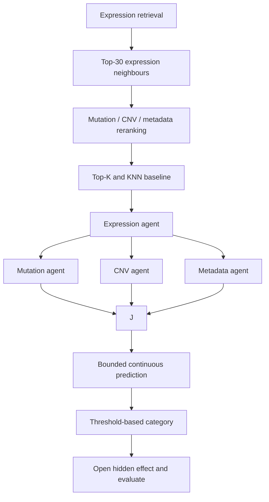

# Multi-Omics RAG for CRISPR Gene Effect

This experiment predicts a continuous CRISPR Gene Effect for one target gene
and one held-out cell line.

## Pipeline

1. Load the target gene and its related genes from
   `target_related_genes.jsonl`.
2. Hide the test model from the reference Gene Effect series.
3. Fit expression imputation and scaling on reference models only.
4. Retrieve the 30 closest expression neighbours.
5. Calculate mutation, CNV, and metadata similarity only for those 30 cases.
6. Rerank the candidates and keep the configured Top-K.
7. Attach their observed target Gene Effect and calculate a deterministic,
   similarity-weighted KNN prediction.
8. Run the expression agent, then run mutation, CNV, and metadata agents in
   parallel with LangGraph.
9. Ask the judge for an evidence-based correction. Python clips that correction,
   calculates the final continuous value, and applies fixed category thresholds.
10. Read the hidden test Gene Effect and evaluate the completed prediction.

The test Gene Effect is read from the source file only after `prediction.json`
has been written. It is never passed to feature selection, scaling, retrieval,
reranking, KNN, prompts, agents, or the judge.

## Run

Use the defaults from `config/settings.yaml`:

```bash
cd "/Users/nident/Desktop/JOB/Cancer Cell Line Encyclopedia (CCLE)/experiments/3_CSDD_RAG"
source ../../.venv/bin/activate
python3 main.py
```

Choose a gene and test model on the command line:

```bash
python3 main.py ACO2 ACH-000475
```

Run the numerical pipeline without API calls:

```bash
python3 main.py ACO2 ACH-000475 --no-llm
```

Skip the six numerical ablation variants:

```bash
python3 main.py ACO2 ACH-000475 --no-ablations
```

Aggregate all completed test cases:

```bash
python3 evaluate.py
```

Run a configured batch of held-out ModelIDs:

```bash
python3 batch.py
```

Change `target_gene`, `test_model_ids`, `use_llm`, and `run_ablations` in
`config/batch_settings.yaml`. A separate `predictions.csv` and `metrics.json`
are written for exactly the ModelIDs listed in that file.

## Configuration

`config/settings.yaml` controls data paths, Top-30 retrieval, Top-K, similarity
weights, component switches, effect thresholds, LLM adjustment bounds, and
ablation execution. `config/models.yaml` contains model parameters. API keys
remain in ignored `config/secrets.yaml`.

## Outputs

Each run is saved under `runs/<gene>_<ModelID>/`:

- `retrieval/expression_top_30.csv`: primary expression retrieval;
- `retrieval/reranked_top_30.csv`: contextual scores and final ranking;
- `retrieval/final_top_k.csv`: cases used by KNN and agents;
- `retrieval/knn_baseline.json`: deterministic prediction and uncertainty;
- `evidence/`: exact local tables supplied to agents;
- `prompts/`: every prompt and estimated token count;
- `agent_outputs/`: structured evidence and judge decision;
- `prediction.json`: prediction without the hidden answer;
- `evaluation.json`: prediction joined with the actual effect afterward;
- `ablations.csv`: component comparisons.

## LangGraph flow


